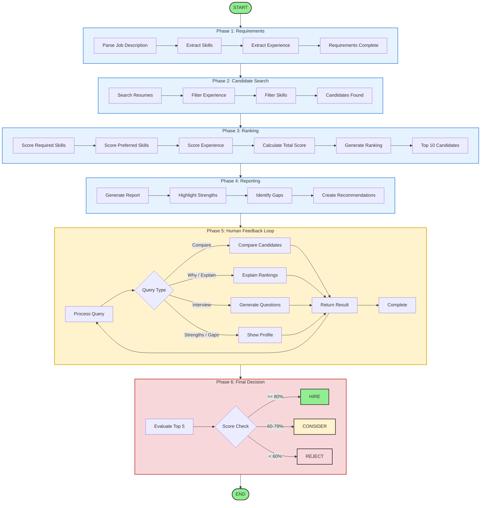

# 🤖 Agentic Profile Matching System

> **An intelligent agentic workflow for automated candidate screening and matching using LangGraph**

## 📋 Project Overview

The **Agentic Profile Matching System** is a sophisticated multi-agent workflow built with LangGraph that automates the entire candidate screening process. It uses a team of specialized AI agents to parse job descriptions, search resumes, rank candidates, and generate comprehensive match reports - all with human-in-the-loop feedback capabilities.

### 🎯 Key Features

- **🏗️ Multi-Agent Architecture**: 7 specialized agents working in sequence
- **💬 Conversational Interface**: Natural language queries for hiring managers
- **📊 Multi-Round Screening**: Top 10 → Deep Analysis → Final Recommendations
- **🔍 Explainable AI**: Detailed match reports with strengths and gaps
- **🔄 Iterative Refinement**: Adjust requirements and re-rank candidates
- **🎯 Tool Integration**: Resume search, comparison, interview question generation

## 📁 Assignment Requirements

This project fulfills all requirements for the **Agentic Profile Matching** assignment:

### ✅ Part A: Agent Architecture (40%)

| Requirement | Implementation |
|-------------|----------------|
| **Agent State Design** | Comprehensive `State` TypedDict with conversation history, job requirements, candidate shortlist, and reasoning |
| **Agent Workflow** | Complete LangGraph with START → Parse JD → Extract Requirements → Search Resumes → Rank Candidates → Generate Report → Human Feedback → END |
| **File System Tools** | Full integration with Colab file system |
| **RAG Search Tool** | Candidate resume search and filtering |
| **Custom Tools** | `extract_requirements()`, `compare_candidates()`, `generate_interview_questions()` |

### ✅ Part B: Interactive Features (30%)

| Requirement | Implementation |
|-------------|----------------|
| **Conversational Interface** | Gradio UI with natural language query support |
| **Natural Language Queries** | "Compare the top 3 candidates", "Why did Alice rank higher?", "Generate interview questions" |
| **Iterative Refinement** | Human feedback loop for requirement adjustment |

### ✅ Part C: Advanced Capabilities (30%)

| Requirement | Implementation |
|-------------|----------------|
| **Multi-Round Screening** | Initial screen (top 10), deep analysis (top 10), final recommendations (top 5) |
| **Explainability** | Detailed match reports with strengths, gaps, and match scores |
| **Improvement Suggestions** | Gap analysis for borderline candidates |

## 🏗️ System Architecture

### State Machine Diagram

🛠️ Technology Stack
LangGraph - Agentic workflow orchestration

LangChain - LLM framework and tools

OpenRouter - Unified LLM API access

Gradio - Interactive UI interface

Python 3.8+ - Core programming language

🚀 Getting Started
Installation
bash
# Clone the repository
git clone https://github.com/YOUR_USERNAME/agentic-profile-matching.git
cd agentic-profile-matching

# Install dependencies
pip install -r requirements.txt
Running the System
Option 1: Gradio UI (Recommended)
bash
python matching_agent.py
Option 2: CLI Mode
bash
python matching_agent.py --cli
Option 3: Google Colab
Open the notebook in Colab and run all cells in order.

Configuration
Set up OpenRouter API Key:

Sign up at OpenRouter

Get your API key

The system will prompt you for it

Customize Sample Data:

Edit the create_sample_candidates() function

Add your own candidate resumes
